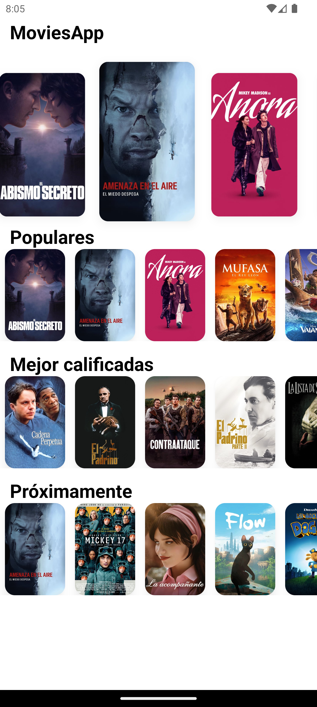

# Movies App

**Movies App** Simple movie info app with react native and expo.

## Installation

To get started the App, follow these steps:

1. Clone the repository:
   ```bash
   git clone https://github.com/sLiMFly/movies-app.git
   ```
2. Install the dependencies:
   ```bash
   npm install
   ```
3. Run the app:
   ```bash
   npm start
   ```

## Usage

Once opened, you can press "a" key to open in virtual device Android, press "i" for iOS, press "w" to view on the web, or scan the QR code on a physical device.

## API Key

Required API key to access the API.
You must obtain your api key from: https://www.themoviedb.org/settings/api

## Video


<div align="center">
  <video src="https://github.com/user-attachments/assets/04792db9-0765-4765-81b6-bbcbdda02fc6
" width="400" />
</div>


https://github.com/user-attachments/assets/1fae393c-ecee-4f33-942c-d1c0a1a52d8e


## Screenshots

<p align="center">
    
</p>
